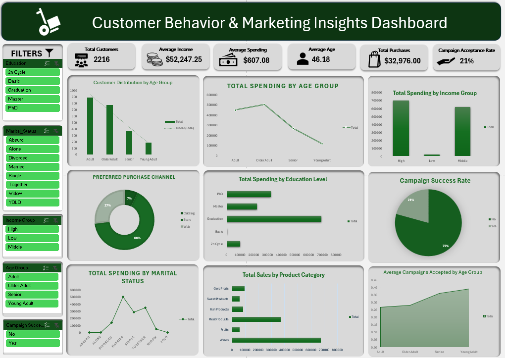
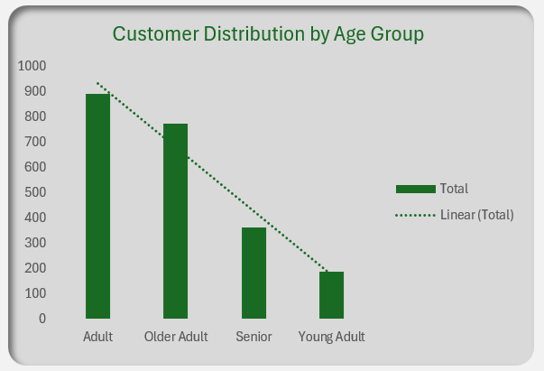
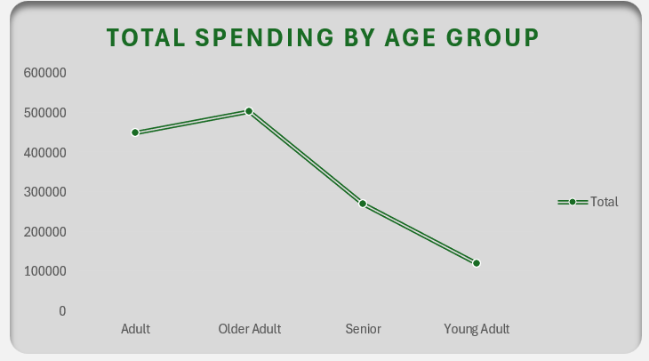
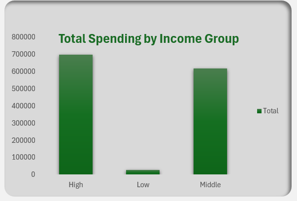
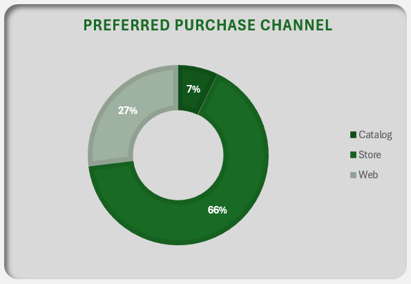
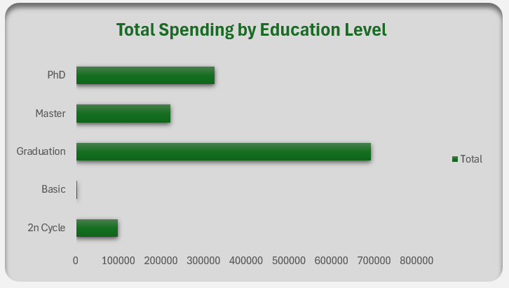
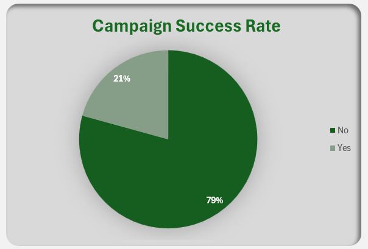
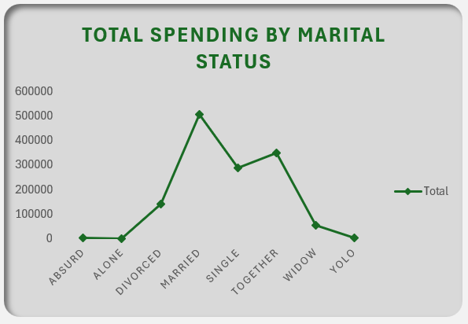
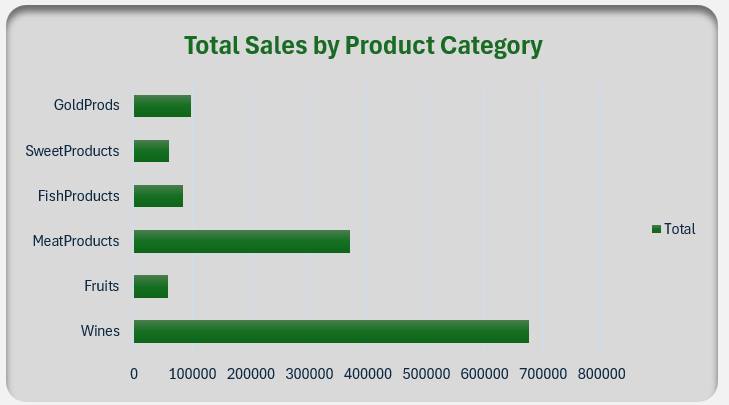
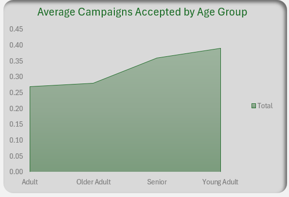

# Customer Behavior & Marketing Insights Dashboard

An interactive Microsoft Excel dashboard that analyzes customer demographics, purchasing behavior, and marketing campaign performance using the **Customer Personality Analysis** dataset. This project demonstrates a complete Excel analytics workflow, including data cleaning, feature engineering, PivotTables, KPI development, and dashboard design.

---

# Dashboard Preview

---

# Project Overview

The objective of this project is to transform raw customer marketing data into an interactive dashboard that provides meaningful business insights. Using Microsoft Excel, the project converts raw customer data into visual reports that help identify purchasing behavior, customer demographics, and marketing campaign performance.

The dashboard allows users to interactively filter data using slicers, making it easier to analyze different customer segments and compare business metrics across multiple dimensions. Based on the insights generated, the project also includes strategic recommendations to support data-driven business decisions.

---

# Business Objectives

This dashboard answers the following business questions:

- Who are the company's primary customers by age group?
- Which income group generates the highest spending?
- How does spending differ across education levels?
- Which marital status contributes the most to customer spending?
- Which purchase channel is preferred by customers?
- Which product category generates the highest sales?
- What percentage of customers accepted at least one marketing campaign?
- Which age group responds best to marketing campaigns?

---

# Dataset

**Dataset:** Customer Personality Analysis

**Source:** [Kaggle – Customer Personality Analysis](https://www.kaggle.com/datasets/imakash3011/customer-personality-analysis)

### Dataset Characteristics

- **Rows:** 2,240 customer records
- **Columns:** 29 original variables
- **Data Type:** Structured tabular dataset
- **Format:** CSV
- **Domain:** Marketing Analytics / Customer Analytics

### Main Categories of Variables

**Customer Demographics**

- ID
- Year_Birth
- Education
- Marital_Status
- Income
- Kidhome
- Teenhome

**Customer Relationship**

- Dt_Customer
- Recency
- Complain

**Product Spending**

- Wines
- Fruits
- Meat
- Fish
- Sweets
- Gold Products

**Purchase Channels**

- Web Purchases
- Catalog Purchases
- Store Purchases
- Web Visits

**Marketing Campaigns**

- Accepted Campaign 1–5
- Response

---

# Data Cleaning

The following data cleaning tasks were performed before analysis:

- Removed records with missing Income values.
- Verified duplicate records.
- Converted the customer registration column (`Dt_Customer`) into Excel Date format.
- Checked categorical columns for inconsistencies and formatting issues.
- Validated numeric columns.
- Verified dataset quality before feature engineering.

---

# Feature Engineering

The following calculated columns were created to support analysis:

| Feature | Description |
|----------|-------------|
| Age_2015 | Calculates customer age using 2015 as the reference year. |
| Age_Group | Groups customers into age categories. |
| Total_Spending | Calculates the total spending across all product categories. |
| Total_Purchases | Calculates the total number of purchases across all purchase channels. |
| Income_Group | Segments customers based on income level. |
| Campaigns_Accepted | Counts the number of accepted marketing campaigns. |
| Campaign_Success | Indicates whether a customer accepted at least one campaign. |
| Preferred_Purchase_Channel | Identifies the customer's most frequently used purchase channel. |

---

# Dashboard Visualizations

## KPI Cards

The dashboard provides an overview of the company's key performance metrics after applying all data cleaning, feature engineering, and PivotTable calculations.

| KPI | Result |
|------|--------|
| **Total Customers** | **2,216** |
| **Average Income** | **$52,247.25** |
| **Average Spending** | **$607.08** |
| **Average Age** | **46.18 years** |
| **Total Purchases** | **32,976** |
| **Campaign Acceptance Rate** | **21%** |

These KPIs automatically update whenever slicers are applied, allowing users to analyze different customer segments dynamically.

---

## Customer Distribution by Age Group

### Insight

The customer base is primarily composed of **Adults**, followed closely by **Older Adults**, making these two groups the company's largest customer segments.

- **Adults** represent **890 customers**, the largest group.
- **Older Adults** account for **775 customers**.
- **Seniors** make up **364 customers**.
- **Young Adults** are the smallest segment with **187 customers**.

This indicates that the company's customer base is largely composed of middle-aged individuals rather than younger customers.

---

## Total Spending by Age Group

### Insight

Customer spending varies noticeably across age groups.

- **Older Adults** generate the highest total spending at **$503,360**.
- **Adults** follow closely with **$450,544** in total spending.
- **Seniors** contribute **$270,660**.
- **Young Adults** contribute the lowest spending at **$120,715**.

Although Adults represent the largest customer segment, Older Adults generate the highest revenue, suggesting they have stronger purchasing power.

---

## Total Spending by Income Group

### Insight

Income has a significant impact on customer spending.

- **High-income customers** contribute **$699,375**, making them the largest revenue source.
- **Middle-income customers** contribute **$619,196**.
- **Low-income customers** account for only *$26,708*.

This demonstrates a clear positive relationship between customer income and purchasing behavior.

---

## Preferred Purchase Channel

### Insight

Customers strongly prefer purchasing through physical stores.

- **Store Purchases:** **66%**
- **Web Purchases:** **27%**
- **Catalog Purchases:** **7%**

Physical stores remain the dominant purchasing channel, while catalog purchases contribute only a small percentage of overall transactions.

---

## Total Spending by Education Level

### Insight

Customer spending differs across education levels.

- **Graduation** customers generate the highest total spending at **$693,802**.
- **PhD** customers rank second with **$325,509**.
- **Master's** degree holders follow closely behind with **$222,565**.
- **2n Cycle** customers contribute relatively little with **$98,986**.
- **Basic** education customers generate the lowest spending with **$4,417**.

Graduates represent the company's most valuable education segment in terms of purchasing behavior.

---

## Campaign Success Rate

### Insight

Marketing campaigns achieved a relatively low acceptance rate.

- **79%** of customers **did not** accept any marketing campaign.
- Only **21%** accepted at least one campaign.

These results suggest that previous marketing campaigns had limited effectiveness and that there is significant opportunity to improve campaign targeting and customer engagement.

---

## Total Spending by Marital Status

### Insight

Marital status also influences purchasing behavior.

- **Married** customers generate the highest total spending.
- **Together** and **Single** customers are the next strongest contributors.
- Customers classified as **Absurd**, **YOLO**, and **Alone** contribute only a small share of overall spending.

The majority of revenue is generated by customers in more common household categories, particularly married individuals.

---

## Total Sales by Product Category

### Insight

Product sales are not evenly distributed across categories.

- **Wine Products** generate the highest sales at **$676,083**.
- **Meat Products** rank second with **$370,063**.
- **Gold Products**, **Fish Products**, **Sweet Products**, and **Fruits** contribute considerably lower sales.

Wine products clearly dominate customer spending, indicating they are the company's strongest-performing product category.

---

## Average Campaigns Accepted by Age Group

### Insight

Marketing campaign responsiveness increases with age.

- **Young Adults** have the highest average campaign acceptance (**~0.39 campaigns per customer**).
- **Seniors** follow (**~0.36**).
- **Older Adults** average **0.28**.
- **Adults** have the lowest average campaign acceptance (**~0.27**).

Although Younger Adults represent the smallest customer segment, they appear to be the most responsive to marketing campaigns.

---

# Strategic Recommendations

- **Launch targeted marketing campaigns for Young Adults**, as they have the highest average campaign acceptance despite being the smallest customer segment, indicating strong potential for higher marketing effectiveness.

- **Strengthen in-store promotions and customer loyalty programs**, since physical stores account for **66%** of all purchases and remain the preferred purchasing channel.

- **Prioritize promotions and inventory planning for Wine and Meat products**, as these categories generate the highest sales and contribute the most to overall revenue.

- **Develop personalized marketing strategies for Older Adults and high-income customers**, as these customer segments generate the highest spending and represent the company's most valuable customers.

- **Improve customer segmentation for future marketing campaigns**, as only **21%** of customers accepted at least one campaign, suggesting opportunities to increase campaign effectiveness through more targeted marketing.

---

# Interactive Features

The dashboard includes slicers that dynamically update every KPI and visualization.

Available slicers:

- Age Group
- Income Group
- Education
- Marital Status
- Campaign Success

---

# Tools Used

- Microsoft Excel
- Excel Tables
- PivotTables
- PivotCharts
- Slicers
- GETPIVOTDATA
- Excel Formulas
- Conditional Formatting

---

# Skills Demonstrated

- Data Cleaning
- Data Validation
- Feature Engineering
- Data Transformation
- PivotTable Analysis
- PivotChart Development
- KPI Development
- Interactive Dashboard Design
- Business Analytics
- Data Visualization
- Microsoft Excel
